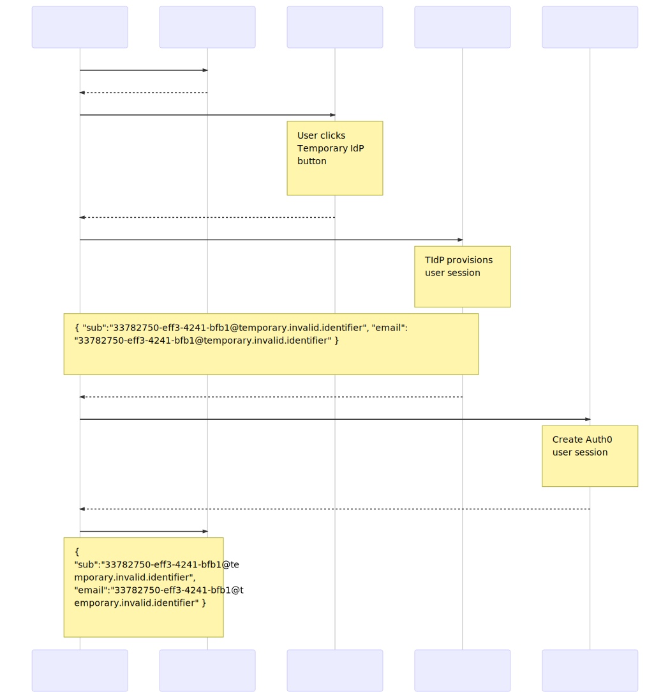
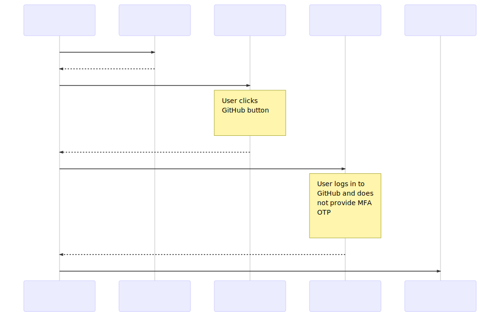
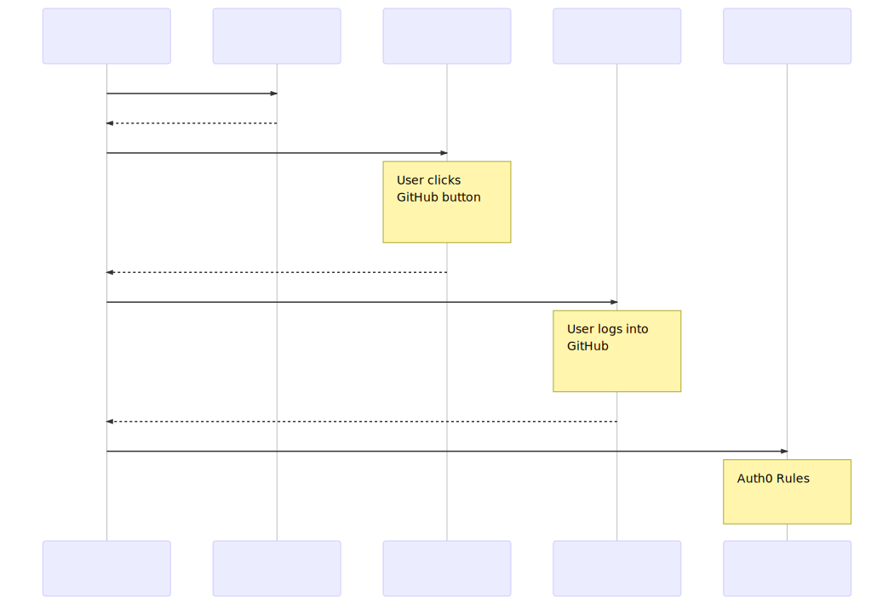
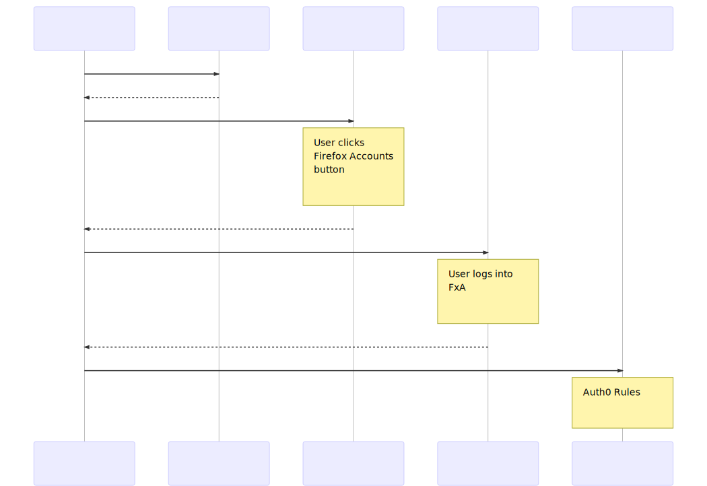

# User logs in with Temporary IdP

```mermaid
sequenceDiagram
    participant User
    participant RP as Relying Party
    participant NLX
    participant TIdP as Temporary IdP
    participant Auth0 as Auth0 Authorization Endpoint
    User->>RP: Browse to RP
    RP-->>User:Redirect to NLX
    User->>NLX:Redirect to NLX
    Note over NLX: User clicks<br/>Temporary IdP<br/>button
    NLX-->>User:Redirect to Temporary IdP
    User->>TIdP:Redirect to Temporary IdP
    Note over TIdP: TIdP provisions<br/>user session
    Note over TIdP,User: {<br/>"sub":"33782750-eff3-4241-bfb1@temporary.invalid.identifier",<br/>"email": "33782750-eff3-4241-bfb1@temporary.invalid.identifier"<br/>}
    TIdP-->>User:Redirect to Auth0
    User->>Auth0:Redirect to Auth0
    Note over Auth0: Create Auth0<br/>user session
    Auth0-->>User:Redirect to RP
    User->>RP:Redirect to RP
    Note over User,RP: {<br/>"sub":"33782750-eff3-4241-bfb1@te<br/>mporary.invalid.identifier", "email":"33782750-eff3-4241-bfb1@t<br/>emporary.invalid.identifier"<br/>}
```

[Deratcheting Temporary IdP](../imgs/deratcheting_temporary_idp.png)

# User succeeds at logging into RP with AAL

```mermaid
sequenceDiagram
    participant User
    participant RP as Relying Party Foo
    participant NLX
    participant GitHub
    participant Auth0 as Auth0 Authorization Endpoint
    User->>RP: Browse to RP
    RP-->>User:Redirect to NLX
    User->>NLX:Redirect to NLX
    Note over NLX: User clicks<br/>GitHub<br/>button
    NLX-->>User:Redirect to GitHub
    User->>GitHub:Redirect to GitHub
    Note over GitHub: User logs in to<br/>GitHub and provides<br/>MFA OTP
    GitHub-->>User:Redirect to Auth0
    User->>Auth0:Redirect to Auth0
```

[Deratcheting Login Success with AAL](../imgs/deratcheting_login_success_aal.png)

* Did GitHub report that the user has a registered MFA method with GitHub?
    * Yes
* Did GitHub report that the user's email address was verified?
    * Yes
* Read apps.yml and check for conformance
    * `apps.yml`

          Relying Party Foo:
            aal_required: AAL1
            expire_access_when_unused_for: 180 days
            authorized_groups: [mozilliansorg_nda]
    * Is this user a member of a group in the `authorized_groups` list
        * Yes
    * Has the user's access been revoked due to not having logged in for too many days (`180 days`)?
        * No
    * Is the AAL provided by this login (`AAL2`) sufficient based on the minimum AAL for this RP (`AAL1`)?
        * Yes
* Therefore allow the user into the RP
* User is redirected to the RP

# User fails to log into RP with AAL

```mermaid
sequenceDiagram
    participant User
    participant RP as Relying Party Foo
    participant NLX
    participant GitHub
    participant Auth0 as Auth0 Authorization Endpoint
    User->>RP: Browse to RP
    RP-->>User:Redirect to NLX
    User->>NLX:Redirect to NLX
    Note over NLX: User clicks<br/>GitHub<br/>button
    NLX-->>User:Redirect to GitHub
    User->>GitHub:Redirect to GitHub
    Note over GitHub: User logs in to<br/>GitHub and does not provide<br/>MFA OTP
    GitHub-->>User:Redirect to Auth0
    User->>Auth0:Redirect to Auth0
```

[Deratcheting Login Failure with AAL](../imgs/deratcheting_login_failure_aal.png)

* Did GitHub report that the user has a registered MFA method with GitHub?
    * No
* Did GitHub report that the user's email address was verified?
    * Yes
* Read apps.yml and check for conformance
    * `apps.yml`

          Relying Party Foo:
            aal_required: AAL2
            expire_access_when_unused_for: 180 days
            authorized_groups: [mozilliansorg_nda]
    * Is this user a member of a group in the `authorized_groups` list?
        * Yes
    * Has the user's access been revoked due to not having logged in for too many days (`180 days`)?
        * No
    * Is the AAL provided by this login (`AAL1`) sufficient based on the minimum AAL for this RP (`AAL2`)?
        * No
* Therefore do not allow the user into the RP
* User is redirected to Error Unauthorized Page

# Account Linking

```mermaid
sequenceDiagram
    participant User
    participant RP as Relying Party
    participant NLX
    participant GitHub
    participant Auth0 as Auth0 Authorization Endpoint
    User->>RP: Browse to RP
    RP-->>User:Redirect to NLX
    User->>NLX:Redirect to NLX
    Note over NLX: User clicks<br/>GitHub<br/>button
    NLX-->>User:Redirect to GitHub
    User->>GitHub:Redirect to GitHub
    Note over GitHub: User logs into GitHub
    GitHub-->>User:Redirect to Auth0
    User->>Auth0:Redirect to Auth0
    Note over Auth0: Auth0 Rules
```

[Deratcheting Account Linking](../imgs/deratcheting_account_linking.png)

## User logs in with the Mozilla IAM system for the first time

* GitHub returns profile of user to Auth0
    * `email=fulan@example.com`
* Auth0 creates a new profile for this new GitHub user
* Does the Auth0 profile contain any additional profiles in the `identities` list indicating that the user's GitHub Auth0 profile is linked to something
    * No, the `identities` list contains only the GitHub profile
* Search for all user profiles in Auth0 where `email=fulan@example.com`
    * One result is returned, the user profile with `user_id` of `github|123456` that was just now created when the user logged in
* Was one result returned?
    * Yes, allow the user to log in to the RP
    * `user_id` is `github|123456`

## User logs in with second IdP for the first time

* GitHub returns profile of user to Auth0
    * `email=fulan@example.com`
* Auth0 creates a new profile for this new GitHub user
* Does the Auth0 profile contain any additional profiles in the `identities` list indicating that the user's GitHub Auth0 profile is linked to something
    * No, the `identities` list contains only the GitHub profile
* Search for all user profiles in Auth0 where `email=fulan@example.com`
    * Two results are returned
        * `user_id=github|123456` : The profile that the user just now logged in with
        * `user_id=ad|mozilla-ldap|fulan@example.com` : A preexisting LDAP profile from when the user logged in before using an LDAP user with the same email address as the GitHub user they just logged in with
* Was one result returned?
    * No, continue with the rules
* Are two results returned?
    * Yes
    * Call the `/api/v2/users/ad|mozilla-ldap|fulan@example.com/identities` Auth0 endpoint to link the GitHub profile to whatever the other returned profile is, in this case LDAP, and set it (LDAP) as primary
        * Pass this to the endpoint `{user_id: github|123456}`
    * Allow the user to log in to the RP
    * `user_id` is `ad|mozilla-ldap|fulan@example.com`

## User logs in with second IdP for a second time

* GitHub returns profile of user to Auth0
    * `email=fulan@example.com`
* Auth0 finds the existing profile for this existing GitHub user
* Does the Auth0 profile contain any additional profiles in the `identities` list indicating that the user's GitHub Auth0 profile is linked to something
    * Yes, the `identities` list contains the GitHub profile and an LDAP profile
    * LDAP is primary because the `user_id` is `ad|mozilla-ldap|fulan@example.com` not `github|123456`
    * Allow the user to login to the RP
    * `user_id` is `ad|mozilla-ldap|fulan@example.com`

## User logs in with third IdP and the first two are already linked

* GitHub returns profile of user to Auth0
    * `email=fulan@example.com`
* Auth0 creates a new profile for this new GitHub user
* Does the Auth0 profile contain any additional profiles in the `identities` list indicating that the user's GitHub Auth0 profile is linked to something
    * No, the `identities` list contains only the GitHub profile
* Search for all user profiles in Auth0 where `email=fulan@example.com`
    * Two results are returned
        * `user_id=github|123456` : The profile that the user just now logged in with
        * `user_id=ad|mozilla-ldap|fulan@example.com` : A preexisting LDAP profile
            * This profile contains an `identities` list with two profiles, indicating that the LDAP profile is linked to another profile
            * The other profile that is linked is `user_id=google-oauth2|789123`
* Was one result returned?
    * No, continue with the rules
* Are two results returned?
    * Yes
    * Call the `/api/v2/users/ad|mozilla-ldap|fulan@example.com/identities` Auth0 endpoint to link the GitHub profile to whatever the other returned profile is, in this case LDAP, and set it (LDAP) as primary
        * Pass this to the endpoint `{user_id: github|123456}`
    * The result is that now both the GitHub profile and the existing Google profile are linked to the LDAP profile which is primary
    * Allow the user to login to the RP
    * `user_id` is `ad|mozilla-ldap|fulan@example.com`

## User logs in with third IdP for the first time and the other two are not linked

```mermaid
sequenceDiagram
    participant User
    participant RP as Relying Party
    participant NLX
    participant FxA as Firefox Accounts
    participant Auth0 as Auth0 Authorization Endpoint
    User->>RP: Browse to RP
    RP-->>User:Redirect to NLX
    User->>NLX:Redirect to NLX
    Note over NLX: User clicks<br/>Firefox Accounts<br/>button
    NLX-->>User:Redirect to Firefox Accounts
    User->>FxA:Redirect to Firefox Accounts
    Note over FxA: User logs into FxA
    FxA-->>User:Redirect to Auth0
    User->>Auth0:Redirect to Auth0
    Note over Auth0: Auth0 Rules
```

[Deratcheting Account Linking with third IdP](../imgs/deratcheting_account_linking_third_idp.png)

* Firefox Accounts returns profile of user to Auth0
    * `email=fulan@example.com`
* Auth0 creates a new profile for this new Firefox Accounts user
* Does the Auth0 profile contain any additional profiles in the `identities` list indicating that the user's Firefox Accounts Auth0 profile is linked to something
    * No, the `identities` list contains only the Firefox Accounts profile
* Search for all user profiles in Auth0 where `email=fulan@example.com`
    * Three results are returned
        * `user_id=oauth2|firefox-accounts|456123` : The profile that the user just now logged in with
        * `user_id=github|123456` : A preexisting GitHub profile
        * `google-oauth2|789123` : A preexisting Google profile
* Was one result returned?
    * No, continue with the rules
* Are two results returned?
    * No, continue with the rules
* Are greater than two results returned?
    * Yes
    * Is the creation date of the Firefox Accounts profile, the one the user just logged in with, within the last 5 minutes?
        * Yes
        * This indicates that this is the first time this user has ever logged in with Firefox Accounts
        * Therefore, exclude Firefox Accounts from the logic which decides what the primary IdP is
        * Of the other IdPs returned, which one is the at the top of the "ratcheting model"
            * The model is LDAP > Firefox Accounts > GitHub > Google > Passwordless
            * GitHub > Google : therefore the primary IdP should be GitHub
            * Note : This means that even though Firefox Accounts is higher in the ratcheting model than GitHub, because the user has never used it before, it is disregarded.
        * Call the `/api/v2/users/github|123456/identities` Auth0 endpoint to link the Firefox Accounts profile to the profile determined to be the primary via ratcheting, in this case GitHub, and set it (GitHub) as primary
            * Pass this to the endpoint `{user_id: oauth2|firefox-accounts|456123}`
        * Call the `/api/v2/users/github|123456/identities` Auth0 endpoint to link the Google profile to the profile determined to be the primary via ratcheting, in this case GitHub, and set it (GitHub) as primary
            * Pass this to the endpoint `{user_id: google-oauth2|789123}`
        * Allow the user to login to the RP
            * `user_id` is `github|123456`

## User logs in with third IdP that they've used before and the other two are not linked

* Firefox Accounts returns profile of user to Auth0
    * `email=fulan@example.com`
* Auth0 finds the existing profile for this existing Firefox Accounts user
* Does the Auth0 profile contain any additional profiles in the `identities` list indicating that the user's Firefox Accounts Auth0 profile is linked to something
    * No, the `identities` list contains only the Firefox Accounts profile
* Search for all user profiles in Auth0 where `email=fulan@example.com`
    * Three results are returned
        * `user_id=oauth2|firefox-accounts|456123` : The profile that the user just now logged in with
        * `user_id=github|123456` : A preexisting GitHub profile
        * `google-oauth2|789123` : A preexisting Google profile
* Was one result returned?
    * No, continue with the rules
* Are two results returned?
    * No, continue with the rules
* Are greater than two results returned?
    * Yes
    * Is the creation date of the Firefox Accounts profile, the one the user just logged in with, within the last 5 minutes?
        * No
        * Therefore, include Firefox Accounts in the logic which decides what the primary IdP is
        * Of the IdPs returned, which one is the at the top of the "ratcheting model"
            * The model is LDAP > Firefox Accounts > GitHub > Google > Passwordless
            * Firefox Accounts > GitHub > Google : therefore the primary IdP should be Firefox Accounts
        * Call the `/api/v2/users/oauth2|firefox-accounts|456123/identities` Auth0 endpoint to link the GitHub profile to the profile determined to be the primary via ratcheting, in this case Firefox Accounts, and set it (Firefox Accounts) as primary
            * Pass this to the endpoint `{user_id: github|123456}`
        * Call the `/api/v2/users/oauth2|firefox-accounts|456123/identities` Auth0 endpoint to link the Google profile to the profile determined to be the primary via ratcheting, in this case Firefox Accounts, and set it (Firefox Accounts) as primary
            * Pass this to the endpoint `{user_id: google-oauth2|789123}`
        * Allow the user to login to the RP
            * `user_id` is `oauth2|firefox-accounts|456123`

